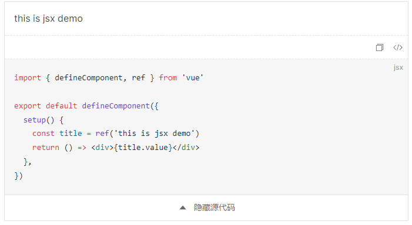
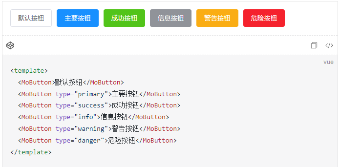
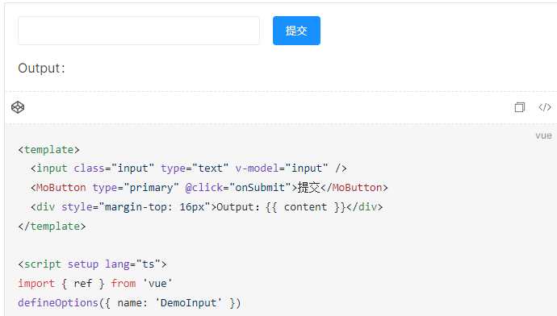

<div align="center">
	<h1 style="margin:10px">vitepress-code-preview</h1>
	<h6 align="center">一款在 vitepress 文档中嵌入 Vue 示例代码的插件, 支持 SFC, JSX, TSX</h6>
</div>

## 🎉 简介

本项目基于 `vitepress`、 `markdown-it` 和 `unified` 实现，它可以帮助你在编写文档的时候嵌入 Vue 示例，支持的 Vue 组件形式有 SFC, JSX, TSX

## 🏄‍♂️ 插件包

| Package                                      | Version (click for changelogs)                                                                       |
| -------------------------------------------- | ---------------------------------------------------------------------------------------------------- |
| [@vitepress-code-preview/container](./)      | [](CHANGELOG.md)     |
| [@vitepress-code-preview/plugin](../plugin/) | [](../plugin/CHANGELOG.md) |

## ⚙️ 安装

```sh
pnpm add @vitepress-code-preview/container @vitepress-code-preview/plugin
```

## ⚡ 快速上手

编辑你的`docs/vite.config.ts`，注册 Vite 插件，如果需要支持 JSX 组件，请安装 `@vitejs/plugin-vue-jsx`

```ts
import { defineConfig } from 'vite'
import vueJsx from '@vitejs/plugin-vue-jsx'
import { viteDemoPreviewPlugin } from '@vitepress-code-preview/plugin'
export default defineConfig({
  plugins: [viteDemoPreviewPlugin(), vueJsx()],
})
```

编辑你的`.vitepress/config.ts`，注册 markdown 插件

```ts
import { fileURLToPath, URL } from 'node:url'
import { defineConfig } from 'vitepress'
import { demoPreviewPlugin } from '@vitepress-code-preview/plugin'

export default defineConfig({
  markdown: {
    config(md) {
      const docRoot = fileURLToPath(new URL('../', import.meta.url))
      md.use(demoPreviewPlugin, { docRoot })
    },
  },
})
```

编辑你的`.vitepress/theme/index.ts`，注册组件容器

```ts
import type { Theme } from 'vitepress'
import DefaultTheme from 'vitepress/theme'
import DemoPreview, { useComponents } from '@vitepress-code-preview/container'
import '@vitepress-code-preview/container/dist/style.css'

export default {
  ...DefaultTheme,
  enhanceApp({ app }: { app: App }) {
    useComponents(app, DemoPreview)
  },
} satisfies Theme
```

### 💡 基础用法

````md
:::demo

```vue
<template>
  <div>{{ title }}</div>
</template>
<script lang="ts" setup>
import { ref, defineComponent } from 'vue'
const title = ref('this is basic demo')
</script>
```

:::
````


### 💪 支持 JSX 和 TSX

````md
:::demo

```jsx
import { defineComponent, ref } from 'vue'

export default defineComponent({
  setup() {
    const title = ref('this is jsx demo')
    return () => <div>{title.value}</div>
  },
})
```

:::
````



### 💡 使用其他组件

````md
:::demo

```vue
<template>
  <MoButton>默认按钮</MoButton>
  <MoButton type="primary">主要按钮</MoButton>
  <MoButton type="success">成功按钮</MoButton>
  <MoButton type="info">信息按钮</MoButton>
  <MoButton type="warning">警告按钮</MoButton>
  <MoButton type="danger">危险按钮</MoButton>
</template>
```

:::
````



### 🐱‍👤 还支持文件引入的方式

```md
:::demo src=examples/Input.vue
:::
```


